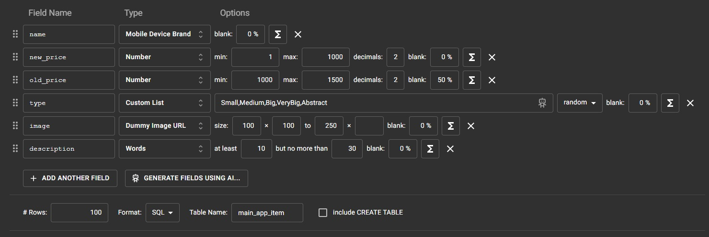
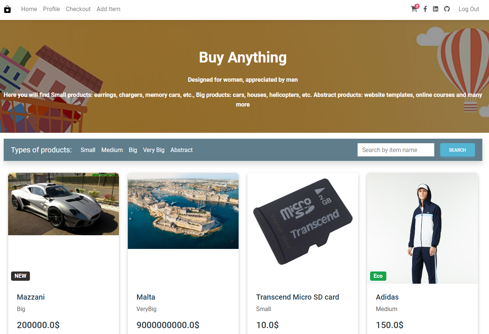
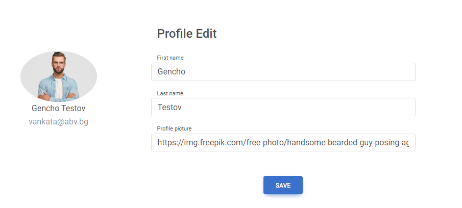
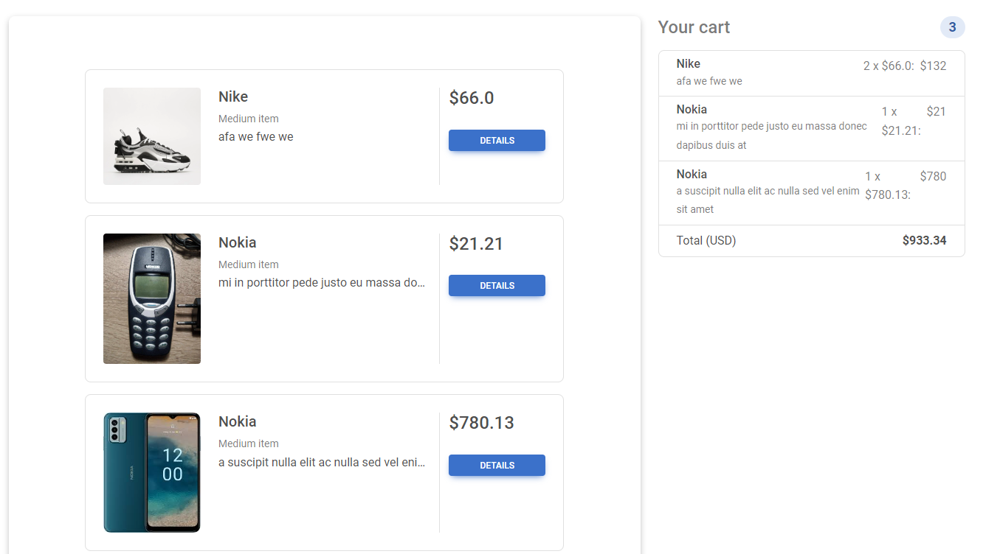

# OnlyShop
This is a web store created with Django, Python, HTML, CSS and Bootstrap

### Here you can:
- Register, Log In, Edit, Delete, View users
- Create, Edit, Delete, View items
- Filter items by name and category
- Add or remove items from shopping bag
- Create shopping orders

### Todo:
- Add/remove Paypal payment 
- Remove Billing info button in profile edit page
- Create save Billing info functionality

### Easy insert test data:
- Open https://www.mockaroo.com/
- Populate database like this:

### Screenshots:

